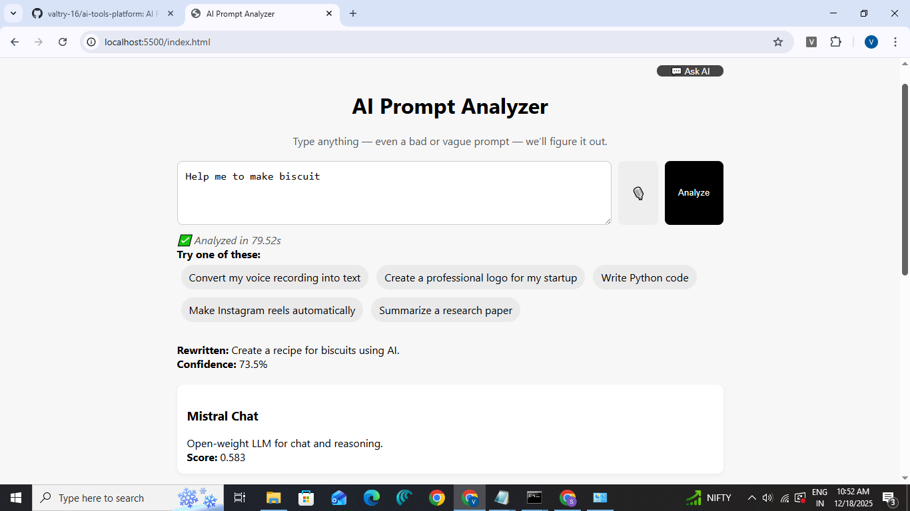
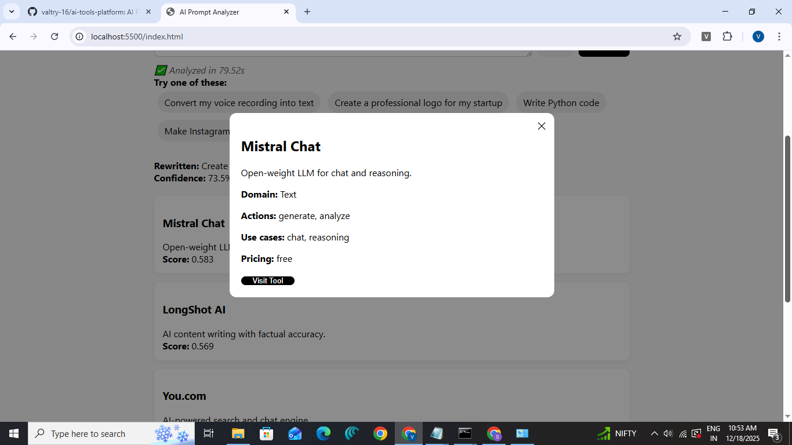
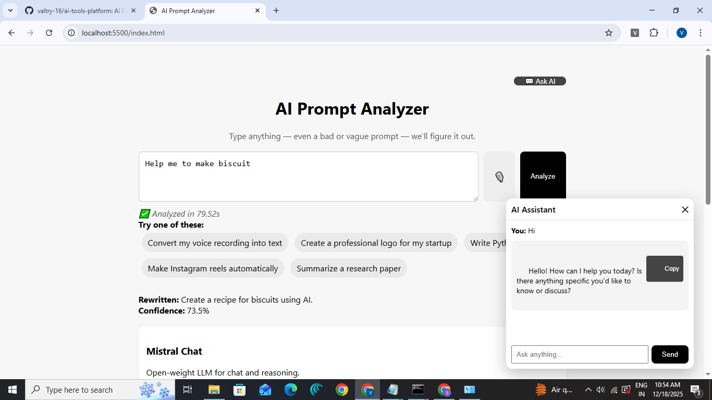

# 🧠 AI Prompt Analyzer & Tool Recommender  
### A Local-First AI Prompt Understanding Platform  
**Developer:** Sabithulla

---

## 📌 Overview

**AI Prompt Analyzer** is an intelligent system that understands vague, unclear, or poorly written prompts and converts them into clear, actionable instructions.  
It then analyzes user intent, calculates confidence, and recommends the most relevant **AI tools** for the task.

The project is designed to work **locally with Ollama**, ensuring:
- 💯 No API keys  
- 🔒 Full privacy  
- 💸 Zero cost  

It also includes an **Ask AI chatbot** for user guidance and support (local mode).

---

## ✨ Why AI Prompt Analyzer?

Most AI tools expect users to write perfect prompts.

**Real users don’t.**

AI Prompt Analyzer bridges that gap by:
- ✏️ Rewriting unclear prompts  
- 🧠 Detecting intent and domain  
- 🛠️ Recommending the right AI tools  
- 📊 Showing confidence with reasoning  
- 💬 Assisting users through a chatbot  

All features work **offline using Ollama**.

---

## 🖼️ Screenshots

### 🔍 Prompt Analysis & Tool Recommendations


### 🧰 Tool Detail Modal


### 💬 Ask AI Chatbot (Local)


---

## 🧪 Example Prompts

- Convert my voice recording into text  
- Create a professional logo for my startup  
- Write Python code for file upload  
- Make Instagram reels automatically  
- Summarize a research paper  

---

## ✨ Key Features

- ✏️ Automatic prompt rewriting  
- 🧠 Intent & domain extraction  
- 🔍 Semantic tool matching (embeddings)  
- 📊 Confidence scoring with breakdown  
- 🛠️ AI tool recommendation engine  
- 💬 Ask AI chatbot (local Ollama)  
- 🎙️ Voice input (browser-based)  
- ⛔ Stop analysis while running  
- 🔒 Fully local & privacy-friendly  

---

## 📊 Confidence Breakdown

Confidence is calculated using:
- **Semantic similarity** – 60%  
- **Intent match** – 25%  
- **Domain match** – 15%  

This helps users understand *why* tools are recommended.

---

## 💬 Ask AI Chatbot (Local Only)

The chatbot helps users:
- Clarify prompts  
- Ask follow-up questions  
- Understand tool suggestions  

⚠️ **Note:**  
Chat works **only in local mode** because Ollama runs on your system.  
Hosted versions show a fallback message.

---

## 🏗️ Architecture

Frontend (HTML + CSS + JavaScript)  
↓  
FastAPI Backend  
↓  
Prompt Analysis Pipeline (NumPy)  
↓  
Ollama (Local LLMs & Embeddings)

---

## 🛠️ Tech Stack

### Backend
- Python 3.9+  
- FastAPI  
- Uvicorn  
- NumPy  
- Requests  
- Ollama  

### Frontend
- HTML  
- CSS  
- JavaScript  
- Web Speech API  

### AI Models (Ollama)
- qwen2:0.5b → Chat  
- nomic-embed-text → Embeddings  

✅ Free  
✅ Offline  
✅ No API keys  

---

## 📂 Project Structure
ai-tools-platform/ 
├── frontend/ │  
 └── index.html │ 
├── src/ │  
 ├── api.py │  
 ├── chat_api.py │  
 ├── final_pipeline_numpy.py │ 
 ├── intent_extractor.py │ 
 ├── prompt_rewriter.py │ 
 ├── filter_tools.py │  
 └── moderation.py │ 
├── data/ │ 
 ├── tools_seed.json │ 
 ├── tool_embeddings.npy │ 
 ├── tool_ids.json │  
 └── bad_prompts.log │ 
├── screenshots/ │ 
 ├── prompt-analysis.png │ 
 ├── tool-details.png │  
 ├── ask-ai-chat.png │  
 └── voice-input.png │ 
└── README.md

---

## ⚙️ Installation & Setup (Local)

### Requirements
- Python 3.9+  
- Ollama installed locally  

### Install Ollama
- https://ollama.com/download

### Pull Required Models
```bash
ollama pull qwen2:0.5b
ollama pull nomic-embed-text
ollama serve

---

### How to Run
### Backend

pip install -r requirements.txt
uvicorn src.api:app --reload

Backend runs at:
http://127.0.0.1:8000

### Frontend
cd frontend
python -m http.server 5500

Open in browser:
http://127.0.0.1:5500

---

### Developer

Valtry
Student • AI Builder • Problem Solver

Built with persistence, debugging, and real-world prompt understanding.

---

### Support

If you find this useful:
⭐ Star the repository
🍴 Fork it
🧠 Extend it

---

📜 License
This project is released under the MIT License.
You are free to use, modify, and distribute it.

---


